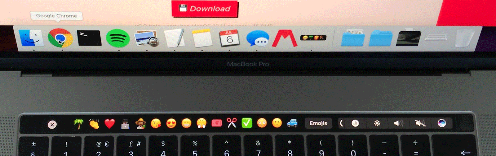
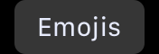
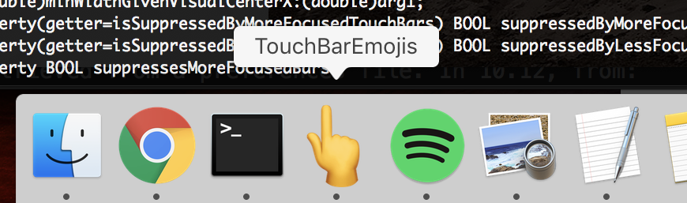

# Touch Bar Emojis app 👆



*Touch Bar Emojis* is a small app (written in Swift) which displays a permanent emoji input view for any app (see below for more info), providing a faster access to emojis, including in apps that don't have an emoji button.

Updated (v1.1) for macOS Mojave (10.14) support.

## Download

1. Make sure you have a Mac with a Touch Bar (or a virtual Touch Bar)

2. [Download the app here](https://github.com/gabriellorin/touch-bar-emojis/releases/download/1.1/TouchBarEmojis.app.zip)

## Features

* Display your most frequently used emojis (on 10.12: the most recently used emojis — MacOS 10.12 doesn't keep track on how many times an emoji is used — and starting in 10.13 your most frequently used emojis)


* Add/remove apps that should show the permanent emoji view (for example apps such as Spotify shouldn't display the emoji view):


* A button  to display the emoji picker (it feels more natural than using the keyboard shortcut control + command + space)

* A close button  to temporarily display an app's original Touch Bar view

* (to display the esc key in an app that displays the permanent emoji view, you can use the fn key (which displays the F keys as well as the esc key))


## How the App works

The app uses a private API for the Touch Bar (discovered by Alexsander Akers: [https://github.com/a2/touch-baer](https://github.com/a2/touch-baer)), which allows us to show/hide a custom view in top of the regular Touch Bar view.

```
+ (void)dismissSystemModalFunctionBar:(id)arg1;
+ (void)presentSystemModalFunctionBar:(id)arg1 systemTrayItemIdentifier:(id)arg2;
```

The view we show/hide consists of your most frequently used emojis. This list is retrieved from a preferences file. In 10.12, from:
```
~/Library/Preferences/com.apple.CharacterPicker.plist
```

and starting in 10.13, from:
```
~/Library/Preferences/com.apple.EmojiPreferences.plist
```

(From 10.13, MacOS will start keeping track of how often we use emojis, unlike 10.12 and prior which was only keeping track on the latest emojis used)

When switching app, *TBE* gets a notification and automatically show/hide the view depending on the apps you've added to the list.


## Installing

The app is a regular app — not a Menu Bar app or a system preference pane. It needs to stay open for the emoji custom view to be displayed (this is a beta version).



## Emoji shortcuts

I also created another app, to create emoji shortcuts (faster than using the Touch Bar): [Momoji.io](https://momoji.io)

## Author

Gabriel Lorin (https://github.com/gabriellorin)

## Contributors

Aaron (https://github.com/Spilly) 🙌

## License

This project is licensed under the MIT License

